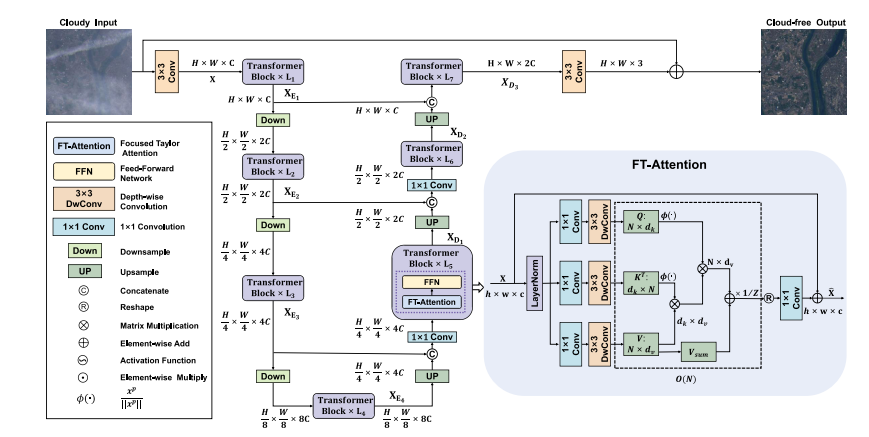
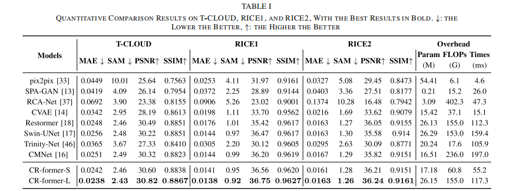
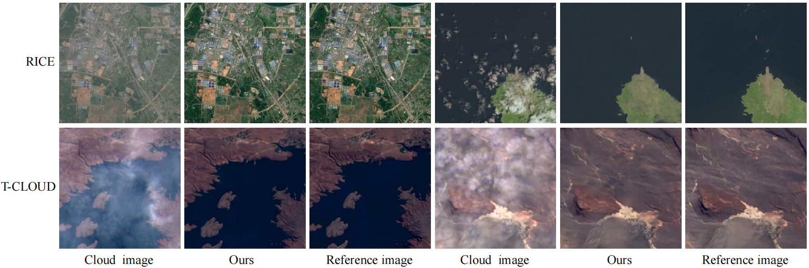

# Attentive Contextual Attention for Cloud Removal

Yang Wu, Ye Deng, SanPingZhou, Yuhan Liu, Wenli Huang, and Jinjun Wang, "CR-former: Single-Image Cloud Removal with Focused Taylor Attention", IEEE Transactions on Geoscience and Remote Sensing (TGRS), 2024

<!-- <!-- #### 🔥🔥🔥 News -->

- **2025-01-24:** Code and pre-trained models are released. 🎊🎊🎊 

---

> **Abstract:** Cloud removal aims to restore high-quality images from cloud-contaminated captures, which is essential in remote sensing applications. Effectively modeling the long-range relationships between image features is key to achieving high-quality cloud-free images. While self-attention mechanisms excel at modeling long-distance relationships, their computational complexity scales quadratically with image resolution, limiting their applicability to high-resolution remote sensing images. Current cloud removal methods have mitigated this issue by restricting the global receptive field to smaller regions or adopting channel attention to model long-range relationships. However, these methods either compromise pixel-level long-range dependencies or lose spatial information, potentially leading to structural inconsistencies in restored images. In this work, we propose the Focused-Taylor Attention (FT-Attention), which captures pixel-level long-range relationships without limiting the spatial extent of attention and achieves the $\mathcal{O}(N)$ computational complexity, where $N$ represents the image resolution. Specifically, we utilize Taylor series expansions to reduce the computational complexity of the attention mechanism from $\mathcal{O}(N^2)$ to $\mathcal{O}(N)$, enabling efficient capture of pixel relationships directly in high-resolution images. Additionally, to fully leverage the informative pixel, we develop a new normalization function for the query and key, which produces more distinguishable attention weights, enhancing focus on important features. Building on FT-Attention, we design a U-net style network, termed the CR-former, specifically for cloud removal. Extensive experimental results on representative cloud removal datasets demonstrate the superior performance of our CR-former.




---


## ⚙️ Installation

- Python 3.9.0

- PyTorch 1.13.1

- NVIDIA GPU + [CUDA](https://developer.nvidia.com/cuda-downloads) 11.7

- Clone this repo:

  ```bash
  git clone https://github.com/wuyang2691/CR-former.git
  cd CR-former
  ```

- Create conda environment:

  ```bash
  conda env create -f CR-former-env.yml -n CR-former
  conda activate CR-former 
  ```


## 🔗 Contents

1. [Datasets](#datasets)
1. [Models](#models)
1. [Training](#training)
1. [Testing](#testing)
1. [Results](#results)
1. [Citation](#citation)
1. [Acknowledgements](#acknowledgements)

---


## <a name="datasets"></a>🖨️ Datasets
- ```RICE-I```: It consists of 500 pairs of filmy and cloud-free images obtained from Google Earth. 
[RICE-I](https://github.com/BUPTLdy/RICE_DATASET)

- ```RICE-II```: It consists of 736 pairs of images captured by Landsat 8 OLI/TIRS, including cloudy, cloudless, and mask images. The mask images were created using the Landsat Level-1 quality band to identify regions affected by clouds, cloud shadows, and cirrus clouds. The cloudless images were captured at the same location as the corresponding cloud images with a maximum interval of 15 days. [RICE-II](https://github.com/BUPTLdy/RICE_DATASET)

- ```T-CLOUD```: The T-CLOUD, a real scene thin cloud dataset captured from Landsat 8 RGB images, contains 2,939 image pairs. The cloudy images and their clear counterparts are separated by one satellite re-entry period (16 days). These images are carefully selected with similar lighting conditions and are cropped into $256 \times 256$ patches. The dataset is split into 2351 images for training and 588 for testing. 
[T-CLOUD](https://github.com/haidong-Ding/Cloud-Removal)


Download training and testing datasets and put them into the corresponding folders of `./datasets/`.


## <a name="models"></a>📦 Models

[Rice1 pretrained model Baidu Disk](https://pan.baidu.com/s/11b6KY2ppR1D7z7ryw3d77A?pwd=3q2m)

[Rice2 pretrained  model Baidu Disk](https://pan.baidu.com/s/1IrN174Qj1OQMGP6cshl7Ig?pwd=77ci)

[T-CLOUD pretrained model Baidu Disk](https://pan.baidu.com/s/1G14XmcsV2BAq6NJOXLxmtA?pwd=aeaq)


## <a name="training"></a>🔧 Training
- The training configuration is in folder `option/RICE1-CR-Former.yml`,  `option/RICE2-CR-Former.yml`, and `option/T-CLOUD-CR-Former.yml`.

    - The argument `dataroot_gt` in the `.yml` file specifies the path to the training dataset.
    - The argument `name` in the `.yml` file specifies the path to the training model (*.pth). By default, it is set to the `./experiments/name` folder.
    - The training experiments are stored in the `./experiments` directory.

- Run the following scripts for training
  ```shell
  # RICE1, input=256*256, 2 GPU
  sh train_script/RICE1.sh
  
  # RICE2, input=256*256, 2 GPU
  sh train_script/RICE2.sh

  # T-CLOUD, input=256*256, 2 GPU
  sh train_script/T-CLOUD.sh
  ```
  ```
   - Set `-opt` as the model configuration option in the '.sh' command.
  ```
 
## <a name="testing"></a>🔨 Testing
- Download the pre-trained [models](https://pan.baidu.com/s/1l7qnrCNAB3ukGENJYA35SA?pwd=9eqw) and place them in `./experiments` directory.

- Use RICE1, RICE2, and T-CLOUD testing datasets.

- Test the model. 
Run the following scripts for training
  ```shell
  # RICE1
  sh test_script/rice1_test.sh

  # RICE2
  sh test_script/rice2_test.sh

  # T-CLOUD
  sh test_script/t_cloud_test.sh
  ```
  ```
  - Set `--opt` as the model configuration option.
  - Set `--input_dir` as the input test dataset path.
  - Set `--input_truth_dir` as the input test dataset ground truth path.
  - Set `--result_dir` as output image path.
  - Set `--weights` as the pretrained-model path.
  - The default results will be saved under the *output* folder.
  ```

## <a name="results"></a>🔎 Results

We achieved state-of-the-art performance. Detailed results can be found in the paper.

<details>
<summary>Quantitative Comparison (click to expand)</summary>

- results in Table I of the main paper

<p align="center">
  
</p>

</details>

<details>
<summary>Visual Comparison (click to expand)</summary>

- results in Figure 1 of the main paper

<p align="center">
  
</p>


</details>


## <a name="citation"></a>📎 Citation

If you find the code helpful in your research or work, please cite the following paper(s).

```
@ARTICLE{wu2024cr,
	author={Wu, Yang and Deng, Ye and Zhou, Sanping and Liu, Yuhan and Huang, Wenli and Wang, Jinjun},
	journal={IEEE Transactions on Geoscience and Remote Sensing}, 
	title={CR-former: Single-Image Cloud Removal With Focused Taylor Attention}, 
	year={2024},
	volume={62},
	number={},
	pages={1-14}}
```

## License
<br />
The codes and the pre-trained models in this repository are under the MIT license as specified by the LICENSE file.
This code is for educational and academic research purpose only.

## <a name="acknowledgements"></a>💡 Acknowledgements

This code is built on [Restormer](https://github.com/swz30/Restormer).

=======
# CR-former
The code will be public after the paper is accepted.
